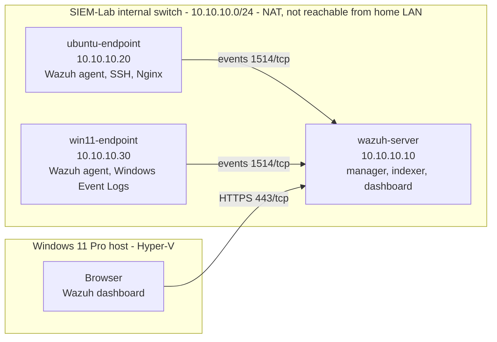

# SIEM Home Lab: Windows, Linux, Web, and Network Security Monitoring

A self-built Security Operations Center (SOC) lab. It collects logs from Linux and Windows endpoints, detects suspicious behavior with Wazuh, and documents each investigation the way a SOC analyst would.

> **Status:** Project 0 complete (lab design and repository setup). Wazuh deployment begins in Project 1.

## Objectives

- Collect, normalize, index, and search logs from Linux, Windows, web-server, and network sources.
- Write detection rules for common attack patterns and validate them with safe, controlled tests.
- Investigate alerts and record findings in structured incident reports.
- Keep every simulation inside an isolated lab network that I own and control.

## Roadmap

| # | Project | Status |
|---|---|---|
| 0 | Lab planning and repository setup | Done |
| 1 | Basic Wazuh SIEM lab (server + Linux and Windows agents) | Next |
| 2 | Linux SSH brute-force detection | Planned |
| 3 | Windows authentication monitoring | Planned |
| 4 | File-integrity monitoring | Planned |
| 5 | Linux privilege and account monitoring | Planned |
| 6 | Web-server (Nginx) security monitoring | Planned |
| 7 | Suricata network IDS integration (optional) | Planned |
| 8 | Alert correlation with Python | Planned |
| 9 | Final portfolio packaging | Planned |

## Architecture



Full design notes: [docs/architecture/lab-architecture.md](docs/architecture/lab-architecture.md)

## Lab Environment

| Component | Role | vCPU | RAM | Disk | Lab IP |
|---|---|---|---|---|---|
| Host (Windows 11 Pro) | Hyper-V, dashboard access, Git, safe test-traffic source | - | - | - | 10.10.10.1 |
| wazuh-server (Ubuntu Server LTS) | Wazuh manager, indexer, dashboard | 4 | 4 GB fixed | 60 GB | 10.10.10.10 |
| ubuntu-endpoint (Ubuntu Server LTS) | Linux agent, SSH target, Nginx, later Suricata | 2 | 1-2 GB dynamic | 25 GB | 10.10.10.20 |
| win11-endpoint (Windows 11) | Windows agent, Security Event Logs | 2 | 2-4 GB dynamic | 64 GB | 10.10.10.30 |

The whole lab runs on one laptop with about 12 GB of RAM. To fit, the Windows endpoint is started only for the projects that need it, and the Wazuh indexer is tuned for a small number of agents.

## Technology Stack

| Area | Tool |
|---|---|
| Virtualization | Hyper-V (Windows 11 Pro) |
| SIEM, endpoint monitoring, FIM | Wazuh 4.x |
| Search and dashboards | Wazuh Dashboard / Wazuh Indexer (OpenSearch-based) |
| Endpoints | Ubuntu Server LTS, Windows 11 |
| Web server | Nginx |
| Network IDS | Suricata (optional) |
| Automation and correlation | Python |
| Diagrams | Mermaid |
| Version control | Git and GitHub |

## Repository Structure

```text
siem-home-lab/
├── README.md
├── LICENSE
├── .gitignore
├── docs/
│   ├── architecture/        # Lab design and diagrams
│   ├── setup-guides/        # Reproducible setup steps
│   ├── incident-reports/    # One report per investigated alert
│   ├── screenshots/         # Evidence for each project
│   └── troubleshooting.md   # Problems hit and how they were fixed
├── detections/              # Custom rules by log source
│   ├── linux/
│   ├── windows/
│   ├── web/
│   ├── network/
│   └── sigma/
├── scripts/                 # Python correlation, enrichment, log generators
├── dashboards/              # Exported dashboard definitions
├── sample-data/sanitized/   # Synthetic or anonymized sample logs only
├── configs/sanitized/       # Config snippets with secrets removed
└── notes/
    └── learning-journal.md
```

## Ethical and Legal Disclaimer

All testing in this repository was performed only on virtual machines I own, on an isolated lab network with no exposure to outside systems. Attack simulations are deliberately limited to harmless actions that generate log evidence, such as intentional failed logins and test file changes.

Do not use any technique described here against systems you do not own or do not have explicit written permission to test. Unauthorized testing is illegal in most jurisdictions. All sample data in this repository is synthetic or sanitized.

## License

Released under the MIT License. See [LICENSE](LICENSE).
