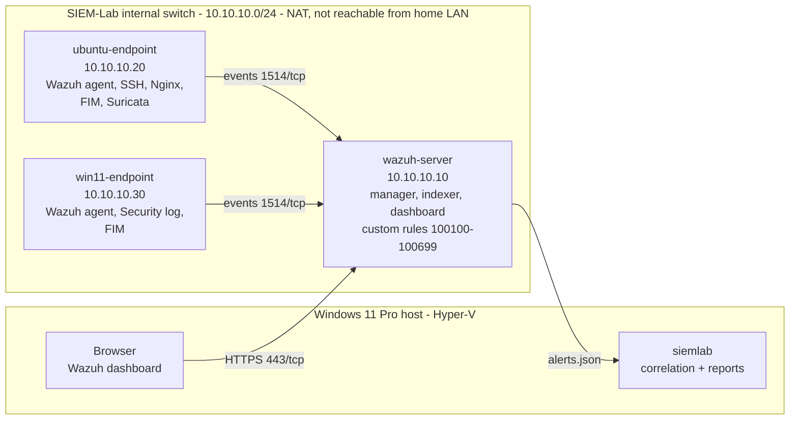

# SIEM Home Lab: Windows, Linux, Web, and Network Security Monitoring

[](https://github.com/exosphere8/siem-home-lab/actions/workflows/ci.yml)


[](LICENSE)

A self-built Security Operations Center (SOC) lab. It collects logs from Linux and Windows
endpoints, detects suspicious behavior with Wazuh, correlates alerts into incidents with a
tested Python toolkit, and documents each investigation the way a SOC analyst would.

> **Status:** Project 0 is complete. The detection content, tooling and runbooks for Projects
> 1-8 are written and validated in CI. Deploying the lab (Project 1) is next, after which each
> detection is validated live and its checklist ticked off. The lab runs Wazuh 4.14.8, and
> every detection is also ported to Wazuh 5, ready for when 5.0 is generally available.

## What's in this repository

| | |
|---|---|
| **[Detections](detections/)** | 35 Wazuh rules, 11 Sigma rules (including two Sigma v2 correlation rules) and 3 Suricata signatures, mapped to [18 ATT&CK techniques](docs/detection-coverage.md). |
| **[Wazuh 5 content pack](detections/wazuh5/)** | The same detections rewritten for Wazuh 5: 30 Sigma-format rules in 6 integrations, checked against the Wazuh Common Schema, with logtest cases and a [rule-by-rule migration map](docs/detection-coverage.md#wazuh-5-migration). |
| **[`siemlab`](src/siemlab/)** | An installable Python package (`pip install siemlab`) that carries the whole lab kit. It correlates Wazuh 4.x alerts or Wazuh 5 findings into incidents and writes incident reports, validates every rule statically (pySigma included), deploys the Wazuh 5 pack and its real-time counting monitors, exports findings, and generates synthetic data for the lab's attack scenarios. |
| **[Automation](scripts/)** | Idempotent Hyper-V PowerShell for the network and VMs (`-WhatIf` everywhere), Windows audit policy, and a rule deployment script that rolls back if Wazuh rejects the configuration. |
| **[Runbooks](docs/)** | Setup guides, an [upgrade runbook](docs/setup-guides/05-upgrading-wazuh.md), one page per project (logic, validation, investigation playbook, tuning), an incident report template, and an auto-generated coverage matrix. |

CI checks every push: rule validation (Wazuh 5 pack included, against the official schema),
an up-to-date coverage matrix, reproducible synthetic samples, a 205-test suite with a 90%
coverage gate, `mypy --strict`, ruff, ShellCheck, PSScriptAnalyzer, a secret scan of the full
history, and a package build that is installed in a clean environment and run outside the
repository.

## Roadmap

| # | Project | Status |
|---|---|---|
| 0 | Lab planning and repository setup | Done |
| 1 | Basic Wazuh SIEM lab (server + Linux and Windows agents) | **Next**: scripts and [guides 01-04](docs/setup-guides/) ready |
| 2 | [Linux SSH brute-force detection](docs/projects/02-ssh-bruteforce.md) | All rules pass logtest on a real Wazuh 4.14.8 manager in CI (8 cases, incl. root-only and mixed brute force); live lab run pending |
| 3 | [Windows authentication monitoring](docs/projects/03-windows-authentication.md) | All rules pass logtest on a real Wazuh 4.14.8 manager in CI (7 cases, Event Channel through the analysis queue); live lab run pending |
| 4 | [File-integrity monitoring](docs/projects/04-file-integrity.md) | Rules statically validated; needs a live agent (FIM events cannot be logtested) |
| 5 | [Linux privilege and account monitoring](docs/projects/05-privilege-and-accounts.md) | All rules pass logtest on a real Wazuh 4.14.8 manager in CI (4 cases); live lab run pending |
| 6 | [Web-server (Nginx) security monitoring](docs/projects/06-nginx.md) | All rules pass logtest on a real Wazuh 4.14.8 manager in CI (8 cases, incl. both 10-probe counters); live lab run pending |
| 7 | [Suricata network IDS integration](docs/projects/07-suricata.md) (optional) | All rules pass logtest on a real Wazuh 4.14.8 manager in CI (4 cases); signatures load in real Suricata; live lab run pending |
| 8 | [Alert correlation with Python](docs/projects/08-alert-correlation.md) | Built and tested on synthetic data; live run pending |
| 9 | Packaging | `siemlab` is an installable package that carries the lab kit; released as v0.4.0 ([changelog](CHANGELOG.md), [releasing](RELEASING.md)) |
| 10 | [Migration to Wazuh 5](docs/setup-guides/05-upgrading-wazuh.md#migrating-to-wazuh-5) | Content pack and tooling written and CI-validated; waiting for Wazuh 5.0 to be generally available |

## Try it without the lab

Install the package (from a release wheel, or from PyPI once it is published) and run it
anywhere: it carries the detections, scripts, runbooks and synthetic samples.

```bash
pip install siemlab-0.5.0-py3-none-any.whl              # or, from a clone: pip install -e ".[dev]"

siemlab demo                                            # correlate the bundled synthetic alerts
siemlab demo --wazuh5                                   # the same attack, as Wazuh 5 findings
siemlab init my-lab && cd my-lab                        # your own copy of the lab kit
siemlab wazuh5 fetch-schema                             # Wazuh Common Schema field list, once
siemlab validate --strict                               # 35 Wazuh + 11 Sigma + 3 Suricata + 30 Wazuh 5 rules
siemlab wazuh5 deploy --dry-run                         # what the Wazuh 5 pack would create
```

Output (38 alerts analysed, 7 incidents):

| ID | Severity | Title | First seen (UTC) | Hosts |
|---|---|---|---|---|
| INC-20261005-001 | 🔴 Critical | Web attack from 10.10.10.50: reconnaissance then exploitation attempts then web-root change | 2026-10-05 09:10:02 | ubuntu-endpoint |
| INC-20261005-002 | 🔴 Critical | Successful login after 8 failures from 10.10.10.50 | 2026-10-05 09:40:05 | ubuntu-endpoint |
| INC-20261005-003 | 🔴 Critical | Persistence chain on ubuntu-endpoint: T1098, T1136, T1548 | 2026-10-05 09:41:45 | ubuntu-endpoint |
| INC-20261005-004 | 🔴 Critical | Persistence chain on win11-endpoint: T1098, T1136 | 2026-10-05 11:10:05 | win11-endpoint |
| INC-20261005-005 | 🟠 High | 10.10.10.50 triggered alerts on 2 hosts | 2026-10-05 09:40:05 | ubuntu-endpoint, win11-endpoint |
| INC-20261005-006 | 🟠 High | Password spraying from 10.10.10.50 against 9 accounts | 2026-10-05 09:40:05 | ubuntu-endpoint, win11-endpoint |
| INC-20261005-007 | 🟠 High | Windows: Security audit log cleared on win11-endpoint | 2026-10-05 11:11:48 | win11-endpoint |

The sample is synthetic (`siemlab generate`), built from the rule metadata in `detections/`.
See an [example incident report](docs/incident-reports/EXAMPLE-synthetic-INC-20261005-002.md).
The Wazuh 5 sample (`siemlab generate --format wazuh5`) holds the findings the Wazuh 5 pack
would write for the same events, and correlates to the same seven incidents. CI checks that.

## Architecture



Full design notes and trade-offs: [docs/architecture/lab-architecture.md](docs/architecture/lab-architecture.md)

## Detection engineering approach

- **Rules map to ATT&CK** (the only exception is a generic Suricata severity escalation) and
  live in the ID block of their project: 100100s for SSH, 100200s for Windows, and so on. The
  validator enforces the ID blocks, unique IDs and resolvable parent rules, and the coverage
  matrix lists any rule without a mapping.
- **Rules chain from signal to story.** A building-block rule labels each event (failed login),
  an aggregate rule counts them (brute force), and an outcome rule catches the moment it
  matters (a successful login from the same source).
- **Wazuh-native and portable.** Wazuh rules run in this lab. The Sigma versions, checked with
  pySigma, carry the same logic to other SIEMs.
- **Validated without attack tooling.** Each project page validates its rules with
  `wazuh-logtest` sample lines or routine administration (creating and removing a test account,
  for example), and records the result in a checklist.
- **Correlation in code.** Patterns that span events and hosts live in `siemlab`, where they are
  unit-tested like any other software.
- **Count categories, not IDs.** Wazuh records only the final rule of each event, so aggregate
  rules count shared groups. The post-mortem
  [Wazuh only remembers the last rule](https://github.com/exosphere8/postmortems/blob/main/wazuh-only-remembers-the-last-rule.md)
  explains the bug that taught this.
- **Upgrades are deliberate.** The lab is pinned to one Wazuh version
  ([`configs/wazuh-version`](configs/wazuh-version)), the packages are held, and the deploy
  script refuses a manager it was not written for. Wazuh 5 cannot load XML rules at all, so
  moving to it was a rewrite: [`detections/wazuh5`](detections/wazuh5/) holds every rule in
  the new format, and the counting rules Wazuh 5 cannot express moved into `siemlab`. The
  pre-mortem
  [Upgrading the lab's Wazuh](https://github.com/exosphere8/postmortems/blob/main/premortem-upgrading-wazuh.md)
  lists what was expected to break and what the port confirmed, and the
  [upgrade runbook](docs/setup-guides/05-upgrading-wazuh.md) is the procedure.

## Lab Environment

| Component | Role | vCPU | RAM | Disk | Lab IP |
|---|---|---|---|---|---|
| Host (Windows 11 Pro) | Hyper-V, dashboard access, Git, siemlab | - | - | - | 10.10.10.1 |
| wazuh-server (Ubuntu Server LTS) | Wazuh manager, indexer, dashboard | 4 | 4 GB fixed | 60 GB | 10.10.10.10 |
| ubuntu-endpoint (Ubuntu Server LTS) | Linux agent, SSH, Nginx, later Suricata | 2 | 1-2 GB dynamic | 25 GB | 10.10.10.20 |
| win11-endpoint (Windows 11) | Windows agent, Security Event Logs | 2 | 2-4 GB dynamic | 64 GB | 10.10.10.30 |

The whole lab runs on one laptop with about 12 GB of RAM. To fit, the Windows endpoint is
started only for the projects that need it (`Set-LabState.ps1 -LabProfile Linux|Windows`),
and the Wazuh indexer heap is reduced to 1 GB.

## Technology Stack

| Area | Tool |
|---|---|
| Virtualization | Hyper-V (Windows 11 Pro), PowerShell automation |
| SIEM, endpoint monitoring, FIM | Wazuh 4.14.8, pinned in [`configs/wazuh-version`](configs/wazuh-version); Wazuh 5 content pack ready |
| Search and dashboards | Wazuh Dashboard / Wazuh Indexer (OpenSearch-based) |
| Detection formats | Wazuh rules (XML), Sigma (validated with pySigma), Suricata signatures |
| Endpoints | Ubuntu Server LTS, Windows 11 |
| Web server | Nginx |
| Network IDS | Suricata (optional) |
| Correlation and tooling | Python 3.11+ (`siemlab`), pytest, mypy, ruff |
| Diagrams | Mermaid |
| CI | GitHub Actions, ShellCheck, PSScriptAnalyzer |

## Repository Structure

```text
siem-home-lab/
├── detections/                  # Detection content, one file per project block
│   ├── linux/                   #   100100 SSH, 100300 FIM, 100400 privilege/accounts
│   ├── windows/                 #   100200 authentication, 100350 FIM
│   ├── web/                     #   100500 Nginx
│   ├── network/                 #   100600 Suricata + suricata-local.rules
│   ├── sigma/                   #   portable Sigma rules (incl. v2 correlations)
│   └── wazuh5/                  #   the Wazuh 5 content pack + 4.x-to-5.x migration map
├── src/siemlab/                 # Python package: alerts, correlate, report, validate, generate,
│                                #   wazuh5 (pack validation), deploy5 (deploy + monitors),
│                                #   export5 (findings), schema (WCS download), kit (lab kit)
├── tests/                       # pytest suite for siemlab and the detection content
├── scripts/
│   ├── hyperv/                  # New-LabNetwork, New-LabVM, Set-LabState
│   ├── windows/                 # Enable-LabAuditPolicy
│   └── deploy/                  # deploy-rules.sh (validate + rollback)
├── configs/
│   ├── wazuh-version            # the one Wazuh version the lab runs (4.14.8)
│   └── sanitized/               # netplan, Wazuh agent/indexer snippets (no secrets)
├── docs/
│   ├── architecture/            # Lab design and trade-offs
│   ├── setup-guides/            # 00 host, 01 network+VMs, 02 server, 03-04 agents, 05 upgrades
│   ├── projects/                # 02-08: logic, validation, playbooks, checklists
│   ├── incident-reports/        # Template + synthetic example
│   ├── detection-coverage.md    # Generated ATT&CK matrix (CI keeps it current)
│   ├── screenshots/             # Evidence for each project
│   └── troubleshooting.md       # Problems hit and how they were fixed
├── sample-data/sanitized/       # Synthetic 4.x alerts and Wazuh 5 findings only
└── notes/learning-journal.md
```

## Ethical and Legal Disclaimer

All testing in this repository was performed only on virtual machines I own, on an isolated
lab network with no exposure to outside systems. Validation relies on replaying sample log
lines with `wazuh-logtest` and on routine administrative actions that generate log evidence.

Do not use any technique described here against systems you do not own or do not have explicit
written permission to test. Unauthorized testing is illegal in most jurisdictions. All sample
data in this repository is synthetic or sanitized. See [SECURITY.md](SECURITY.md).

## License

Free for noncommercial use under the PolyForm Noncommercial License 1.0.0; commercial use
needs a [commercial license](COMMERCIAL-LICENSE.md). © 2026 Midnight Croissant. Versions up to
0.4.0 remain MIT. See [LICENSE](LICENSE) and
[THIRD_PARTY_NOTICES.md](THIRD_PARTY_NOTICES.md), which includes the MITRE ATT&CK®
attribution. Wazuh® is a registered trademark of Wazuh, Inc.; this project is independent and
not affiliated with or endorsed by Wazuh, Inc.
