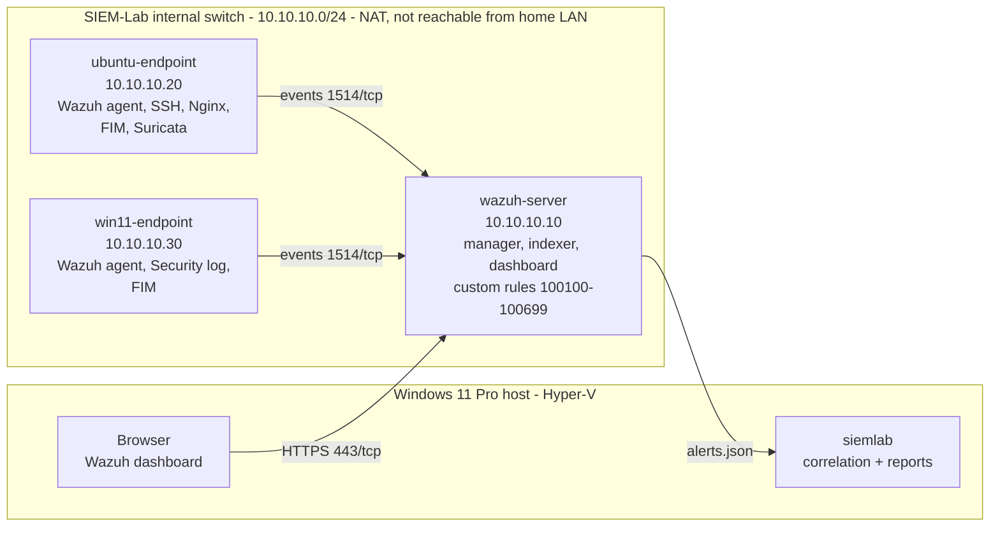

# SIEM Home Lab: Windows, Linux, Web, and Network Security Monitoring

[](https://github.com/exosphere8/siem-home-lab/actions/workflows/ci.yml)


[](LICENSE)

A self-built Security Operations Center (SOC) lab. It collects logs from Linux and Windows
endpoints, detects suspicious behavior with Wazuh, correlates alerts into incidents with a
tested Python toolkit, and documents each investigation the way a SOC analyst would.

> **Status:** Project 0 is complete. The detection content, tooling and runbooks for Projects
> 1-8 are written and validated in CI. Deploying the lab (Project 1) is next, after which each
> detection is validated live and its checklist ticked off.

## What's in this repository

| | |
|---|---|
| **[Detections](detections/)** | 33 Wazuh rules, 11 Sigma rules (including two Sigma v2 correlation rules) and 3 Suricata signatures, mapped to [18 ATT&CK techniques](docs/detection-coverage.md). |
| **[`siemlab`](src/siemlab/)** | Python toolkit that correlates Wazuh `alerts.json` into incidents and writes incident reports. It also validates every rule statically (pySigma included) and generates synthetic alerts for the lab's attack scenarios. |
| **[Automation](scripts/)** | Idempotent Hyper-V PowerShell for the network and VMs (`-WhatIf` everywhere), Windows audit policy, and a rule deployment script that rolls back if Wazuh rejects the configuration. |
| **[Runbooks](docs/)** | Setup guides, one page per project (logic, validation, investigation playbook, tuning), an incident report template, and an auto-generated coverage matrix. |

CI checks every push: rule validation, an up-to-date coverage matrix, a reproducible synthetic
sample, a 94-test suite with a 90% coverage gate, `mypy --strict`, ruff, ShellCheck and PSScriptAnalyzer.

## Roadmap

| # | Project | Status |
|---|---|---|
| 0 | Lab planning and repository setup | Done |
| 1 | Basic Wazuh SIEM lab (server + Linux and Windows agents) | **Next**: scripts and [guides 01-04](docs/setup-guides/) ready |
| 2 | [Linux SSH brute-force detection](docs/projects/02-ssh-bruteforce.md) | Rules written and CI-validated; lab validation pending |
| 3 | [Windows authentication monitoring](docs/projects/03-windows-authentication.md) | Rules written and CI-validated; lab validation pending |
| 4 | [File-integrity monitoring](docs/projects/04-file-integrity.md) | Rules written and CI-validated; lab validation pending |
| 5 | [Linux privilege and account monitoring](docs/projects/05-privilege-and-accounts.md) | Rules written and CI-validated; lab validation pending |
| 6 | [Web-server (Nginx) security monitoring](docs/projects/06-nginx.md) | Rules written and CI-validated; lab validation pending |
| 7 | [Suricata network IDS integration](docs/projects/07-suricata.md) (optional) | Rules written and CI-validated; lab validation pending |
| 8 | [Alert correlation with Python](docs/projects/08-alert-correlation.md) | Built and tested on synthetic data; live run pending |
| 9 | Final portfolio packaging | In progress |

## Try it without the lab

```bash
git clone https://github.com/exosphere8/siem-home-lab.git && cd siem-home-lab
python -m venv .venv && source .venv/bin/activate      # Windows: .venv\Scripts\activate
pip install -e ".[dev]"

siemlab validate                                        # 33 Wazuh + 11 Sigma + 3 Suricata rules
siemlab correlate sample-data/sanitized/alerts-synthetic.json
siemlab correlate sample-data/sanitized/alerts-synthetic.json --report-dir reports/
```

Output (38 alerts analysed, 7 incidents):

| ID | Severity | Title | First seen (UTC) | Hosts |
|---|---|---|---|---|
| INC-20261005-001 | 🔴 Critical | Web attack from 10.10.10.50: reconnaissance then exploitation attempts then web-root change | 2026-10-05 09:10:02 | ubuntu-endpoint |
| INC-20261005-002 | 🔴 Critical | Successful login after 8 failures from 10.10.10.50 | 2026-10-05 09:40:05 | ubuntu-endpoint |
| INC-20261005-003 | 🔴 Critical | Persistence chain on ubuntu-endpoint: T1098, T1136, T1548 | 2026-10-05 09:41:45 | ubuntu-endpoint |
| INC-20261005-004 | 🔴 Critical | Persistence chain on win11-endpoint: T1098, T1136 | 2026-10-05 11:10:05 | win11-endpoint |
| INC-20261005-005 | 🟠 High | 10.10.10.50 triggered alerts on 2 hosts | 2026-10-05 09:40:05 | ubuntu-endpoint, win11-endpoint |
| INC-20261005-006 | 🟠 High | Password spraying from 10.10.10.50 against 9 accounts | 2026-10-05 09:40:05 | ubuntu-endpoint, win11-endpoint |
| INC-20261005-007 | 🟠 High | Windows: Security audit log cleared on win11-endpoint | 2026-10-05 11:11:48 | win11-endpoint |

The sample is synthetic (`siemlab generate`), built from the rule metadata in `detections/`.
See an [example incident report](docs/incident-reports/EXAMPLE-synthetic-INC-20261005-002.md).

## Architecture



Full design notes and trade-offs: [docs/architecture/lab-architecture.md](docs/architecture/lab-architecture.md)

## Detection engineering approach

- **Rules map to ATT&CK** (the only exception is a generic Suricata severity escalation) and
  live in the ID block of their project: 100100s for SSH, 100200s for Windows, and so on. The
  validator enforces the ID blocks, unique IDs and resolvable parent rules, and the coverage
  matrix lists any rule without a mapping.
- **Rules chain from signal to story.** A building-block rule labels each event (failed login),
  an aggregate rule counts them (brute force), and an outcome rule catches the moment it
  matters (a successful login from the same source).
- **Wazuh-native and portable.** Wazuh rules run in this lab. The Sigma versions, checked with
  pySigma, carry the same logic to other SIEMs.
- **Validated without attack tooling.** Each project page validates its rules with
  `wazuh-logtest` sample lines or routine administration (creating and removing a test account,
  for example), and records the result in a checklist.
- **Correlation in code.** Patterns that span events and hosts live in `siemlab`, where they are
  unit-tested like any other software.

## Lab Environment

| Component | Role | vCPU | RAM | Disk | Lab IP |
|---|---|---|---|---|---|
| Host (Windows 11 Pro) | Hyper-V, dashboard access, Git, siemlab | - | - | - | 10.10.10.1 |
| wazuh-server (Ubuntu Server LTS) | Wazuh manager, indexer, dashboard | 4 | 4 GB fixed | 60 GB | 10.10.10.10 |
| ubuntu-endpoint (Ubuntu Server LTS) | Linux agent, SSH, Nginx, later Suricata | 2 | 1-2 GB dynamic | 25 GB | 10.10.10.20 |
| win11-endpoint (Windows 11) | Windows agent, Security Event Logs | 2 | 2-4 GB dynamic | 64 GB | 10.10.10.30 |

The whole lab runs on one laptop with about 12 GB of RAM. To fit, the Windows endpoint is
started only for the projects that need it (`Set-LabState.ps1 -LabProfile Linux|Windows`),
and the Wazuh indexer heap is reduced to 1 GB.

## Technology Stack

| Area | Tool |
|---|---|
| Virtualization | Hyper-V (Windows 11 Pro), PowerShell automation |
| SIEM, endpoint monitoring, FIM | Wazuh 4.x |
| Search and dashboards | Wazuh Dashboard / Wazuh Indexer (OpenSearch-based) |
| Detection formats | Wazuh rules (XML), Sigma (validated with pySigma), Suricata signatures |
| Endpoints | Ubuntu Server LTS, Windows 11 |
| Web server | Nginx |
| Network IDS | Suricata (optional) |
| Correlation and tooling | Python 3.11+ (`siemlab`), pytest, mypy, ruff |
| Diagrams | Mermaid |
| CI | GitHub Actions, ShellCheck, PSScriptAnalyzer |

## Repository Structure

```text
siem-home-lab/
├── detections/                  # Detection content, one file per project block
│   ├── linux/                   #   100100 SSH, 100300 FIM, 100400 privilege/accounts
│   ├── windows/                 #   100200 authentication, 100350 FIM
│   ├── web/                     #   100500 Nginx
│   ├── network/                 #   100600 Suricata + suricata-local.rules
│   └── sigma/                   #   portable Sigma rules (incl. v2 correlations)
├── src/siemlab/                 # Python toolkit: alerts, correlate, report, validate, generate
├── tests/                       # pytest suite for siemlab and the detection content
├── scripts/
│   ├── hyperv/                  # New-LabNetwork, New-LabVM, Set-LabState
│   ├── windows/                 # Enable-LabAuditPolicy
│   └── deploy/                  # deploy-rules.sh (validate + rollback)
├── configs/sanitized/           # netplan, Wazuh agent/indexer snippets (no secrets)
├── docs/
│   ├── architecture/            # Lab design and trade-offs
│   ├── setup-guides/            # 00 host, 01 network+VMs, 02 server, 03-04 agents
│   ├── projects/                # 02-08: logic, validation, playbooks, checklists
│   ├── incident-reports/        # Template + synthetic example
│   ├── detection-coverage.md    # Generated ATT&CK matrix (CI keeps it current)
│   ├── screenshots/             # Evidence for each project
│   └── troubleshooting.md       # Problems hit and how they were fixed
├── sample-data/sanitized/       # Synthetic alerts only
└── notes/learning-journal.md
```

## Ethical and Legal Disclaimer

All testing in this repository was performed only on virtual machines I own, on an isolated
lab network with no exposure to outside systems. Validation relies on replaying sample log
lines with `wazuh-logtest` and on routine administrative actions that generate log evidence.

Do not use any technique described here against systems you do not own or do not have explicit
written permission to test. Unauthorized testing is illegal in most jurisdictions. All sample
data in this repository is synthetic or sanitized. See [SECURITY.md](SECURITY.md).

## License

Released under the MIT License. See [LICENSE](LICENSE).
